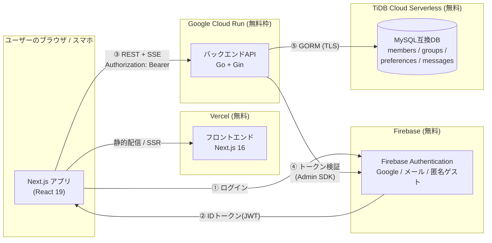
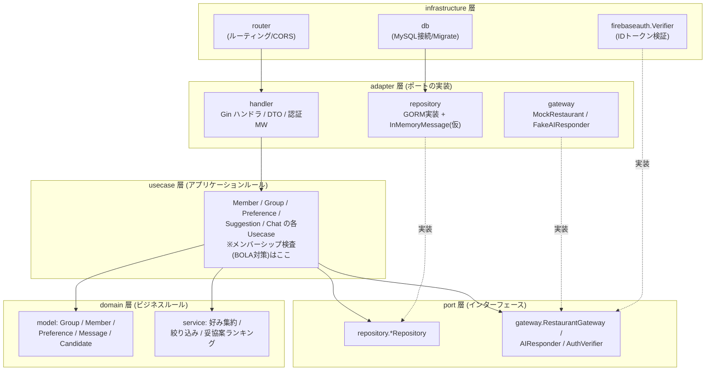
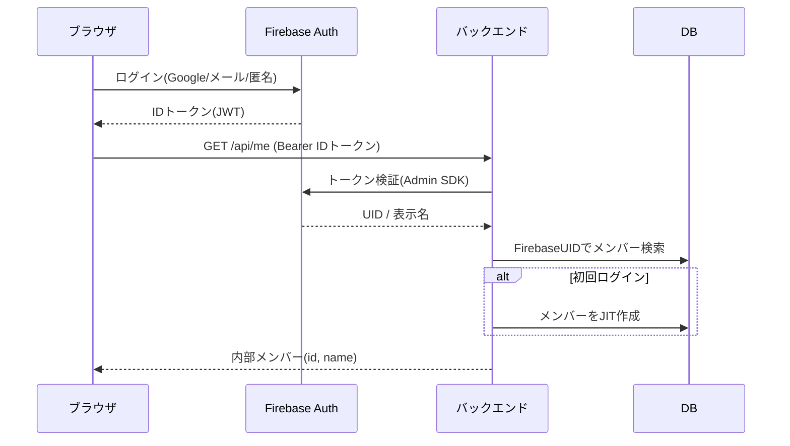
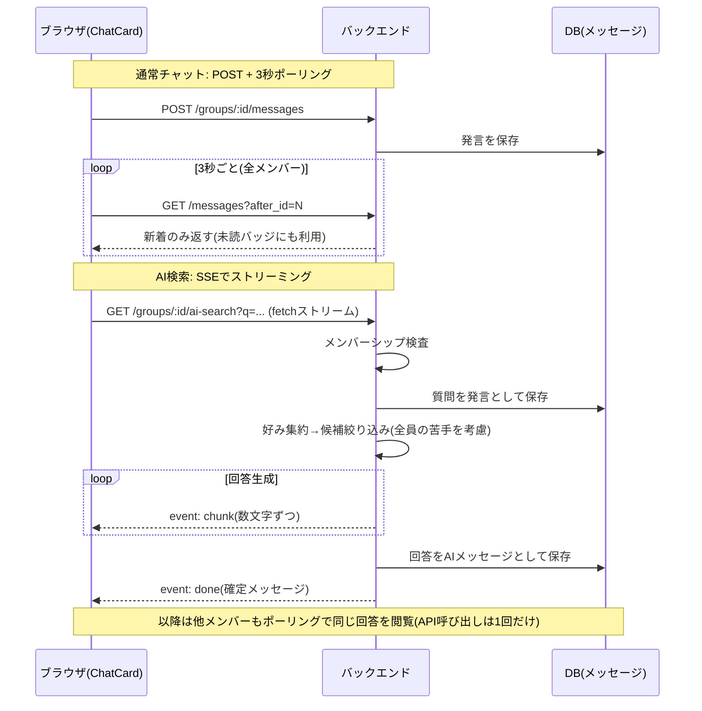

# FoodLike アーキテクチャ構成図

Mermaid記法。GitHub / VS Code(拡張) でそのままレンダリングされ、レポートにも流用できる。

## 1. システム構成図(デプロイ構成 / 案A: 全フリーティア)

- 全構成が無料枠に収まる。AI検索もLLM APIを使わず、ルールベースのフェイク実装(コスト0)で提供する
- Cloud RunをFirebaseと同一GCPプロジェクト(foodlikeauth)に置くことで、サービスアカウント鍵ファイル不要(ADCで検証)

## 2. バックエンドのレイヤードアーキテクチャ

依存の向きは常に外側→内側。ドメイン層は他の層を一切知らない。

差し替え可能ポイント(ポートの実装を入れ替えるだけで、usecase以下は無変更):

| ポート | 現在の実装 | 将来の実装 |
|---|---|---|
| `MessageRepository` | インメモリ(仮) | GORM + messagesテーブル |
| `RestaurantGateway` | モック店舗データ | ホットペッパーAPI |
| `AIResponder` | ルールベース(テンプレート文生成) | LLM API(必要になったら) |
| `AuthVerifier` | Firebase Admin SDK | (モック認証MWと起動時に切替) |

## 3. 認証フロー(JITメンバー登録)

## 4. チャット/AI検索フロー(SSEストリーミング)

