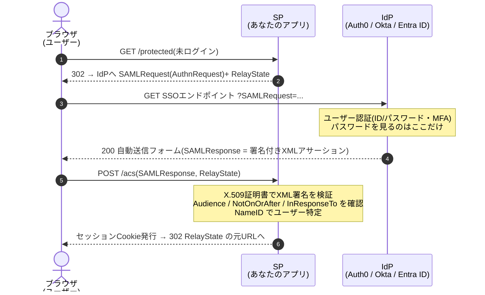
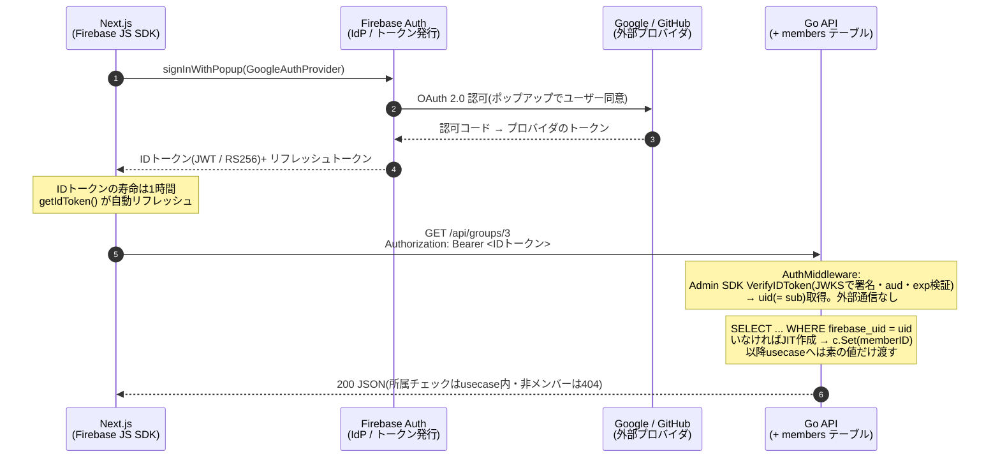

# 認証フロー図解 — SAML と Firebase Auth

どちらも「パスワードは IdP が預かり、アプリは検証済みのトークンだけ受け取る」構図は同じ。
違いはトークンの形式(XML か JWT か)と、誰がどの経路で運ぶか。

## SAML 2.0 — SP-initiated SSO(Auth0 / Okta などのエンタープライズ SSO)

アサーション(XML)は**ブラウザ経由(フロントチャネル)**で運ばれ、SP は IdP と直接通信しない。

ポイント:

- **アサーションはブラウザを経由する**(フロントチャネル)。だから XML 署名が必須 — 改ざんされていないことを SP が自力で確かめる。
- **SP と IdP は直接通信しない**。事前に交換したメタデータ(証明書・エンドポイントURL)だけで信頼関係が成立する。
- Auth0 を使う場合、アプリから見た Auth0 は OIDC の IdP で、**Auth0 が SAML の SP として**顧客企業の Okta 等と話す「ブリッジ」構成が定番。アプリは SAML を直接触らない。

## Firebase Auth — FoodLike の構成(OIDC / JWT ベース)

Google / GitHub ログインを Firebase が仲介し、アプリには常に同じ形式の **ID トークン(JWT)** が届く。Go API はプロバイダを知らない。

ポイント:

- **手順2–3はFirebaseとプロバイダの間で完結**。GitHubログインを追加してもフロントは1行、Go APIは変更ゼロ。
- **検証はオフラインで済む**のがSAMLとの対照点。JWTは自己完結型で、公開鍵さえキャッシュしていれば毎リクエストの検証に外部通信が要らない。
- **トークンはヘッダーでAPIに直行**(SAMLのような自動POSTフォームの往復がない)。SPA + API構成に噛み合う。

## ひと目で比較

| | SAML 2.0 | Firebase Auth(OIDC系) |
|---|---|---|
| トークン形式 | XMLアサーション + XML署名 | JWT(RS256) |
| 運搬経路 | ブラウザの自動POSTフォーム(フロントチャネル) | `Authorization: Bearer` ヘッダー |
| 検証方法 | メタデータ交換したX.509証明書でXML署名検証 | 公開JWKSで署名検証(オフライン可) |
| ユーザー識別子 | `NameID` | `sub`(= Firebase UID) |
| 主戦場 | 企業SSO、B2B SaaS(Okta / Entra ID連携) | コンシューマ向けWeb / モバイル |
| アプリ側の保存物 | NameID ↔ 自前ユーザーの対応 | `firebase_uid` ↔ `members.id` の対応 |

> どちらの方式でも、アプリのDBにパスワードカラムは存在しない。
